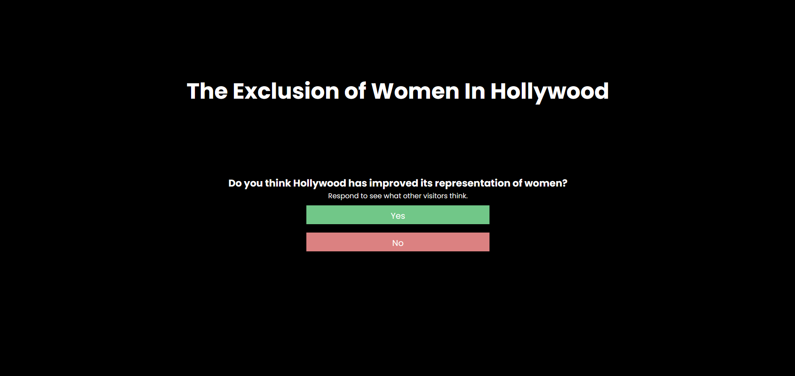

# Women in Hollywood
## by Jennifer Wang and Alvin Zhu

Hosted on: https://6859-sp21.github.io/final-project-women-in-hollywood-final/

Link to video: https://www.youtube.com/watch?v=71PM0bM5ACg

Link to paper: https://github.com/6859-sp21/final-project-women-in-hollywood-final/blob/main/FinalPaper.pdf

Abstract: We like to think of society as ever progressing. It is convenient and comfortable to think that time fixes all mistakes - and under this mindset, it is easy to believe that Hollywood has become better in its representation of a diverse array of people since its inception. In order to explore these assumptions, we utilize the Bechdel Test as a metric for assessing the representation of women within a movie. Through a series of interactive data visualizations that take the audience from any one movie in particular to the whole overarching trend of movies in a 40 year time span, we begin to understand the truth of our optimistic sentiments regarding Hollywood. Although it is true that women have become better represented in Hollywood over time, the magnitude of this upward change is disappointingly small. Thus, we conclude Hollywood still has a long way to go before it can provide an accurate reflection of modern-day feminist ideals in society.

## An overview of our development process

This project is a continuation of our A4 visualization, which featured a linked line chart and bubble chart that explored a range of movies and whether or not each one passed the Bechdel Test. The work in total was spread out over the course of 6 weeks, and was split evenly between teammates. A more concrete breakdown is included at the end of this README. 

As our A4 visualization was very open-ended and featured a wide range of movies, we decided to add on to the project in order to create a martini-glass style narrative structure about the lack of representation of women in Hollywood films. As a result, we added: 
* a poll at the beginning of the visualization, meant to introduce users to the issue we are trying to address and to have them reflect on their own assumptions
* a short mini-quiz asking users to guess if a movie has passed the Bechdel Test out of ten highly grossing movies, with a corresponding bar graph placing their results against the average of previous players
* a visualization of the top ten highest grossing movies that failed the Bechdel Test over the span of twenty years
* a series of line graphs separating movies into genres and plotting the percentage of movies passing the Bechdel Test over the year

We added on our main A4 visualization at the end to encourage users to explore the dataset more freely, concluding our martini-glass structure. 

Jennifer worked on the following things: 
* The appearance/functionality of the poll and its results
* Constructing the miniquiz as a carousel
* The highest-grossing movies chart depicting blockbusters that have failed the Bechdel Test
* The content of the introduction and concluding section

Alvin worked on the following things:
* Creating the database for the poll and the mini-quiz
* The functionality of the miniquiz
* The grouped bar graph for the results of the miniquiz
* The small multiple area charts of movies broken down by genre
* The scrolly-telling aesthetics, spaceing out formatting of the visualization